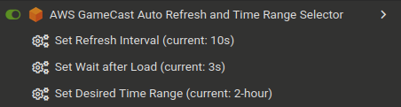

# AWS GameCast Auto Refresh and Time Range Selector Userscript

Auto-refreshes and applies time-range filters on AWS GameCast Stream Group pages. Yee haw!

## Compatibility

> [!WARNING]
> Due to AWS Console's Content Security Policy, and due to shortcomings in Violentmonkey, this userscript will *only* work in [Tampermonkey](https://www.tampermonkey.net/).

## Customizing Settings

Access the userscript menu in your userscript manager toolbar to adjust:

- **Refresh Interval:** How often the page reloads.
- **Wait after Load:** Delay before performing actions after the page loads.
- **Desired Time Range:** The default selected time-range filter. Inspect the AWS Console page's sourecode to find the desired `value` for the `type="radio"` element.

For example:

## Support & Issues

Report issues or request enhancements on the [GitHub issues page](https://github.com/toastercup/userscripts/issues).

## License

[MIT](LICENSE)
